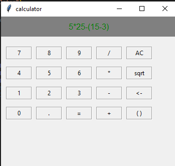
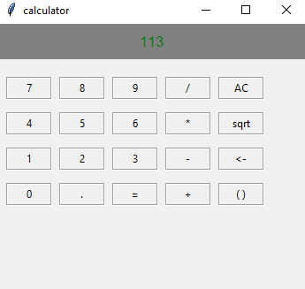

# Tkinter Advanced Calculator

This project is a fully functional desktop calculator application built using Python and the **Tkinter** library. It features a custom parser to handle the **order of operations** and supports nested parentheses. This demonstrates strong command of GUI development and algorithmic problem-solving.

## Key Technical Highlights

The application showcases the following advanced concepts:

1.  **GUI Development (Tkinter):**
    * Designed and implemented a responsive user interface with dynamic input handling and clear visual feedback.
    * Effective use of Tkinter widgets (`Button`, `Label`, `Tk`) and geometry management (`place`).

2.  **Algorithmic Expression Parsing:**
    * **Custom Tokenization (`convert`):** Manually tokenizes the input string into numbers, operators, and parentheses.
    * **Order of Operations (`prioritety`):** Implemented a **recursive function** to solve mathematical expressions. It prioritizes operations in the following order: **Parentheses ($\mathbf{(~)}$)** $\rightarrow$ **Unary Minus ($\mathbf{-}$)** $\rightarrow$ **Multiplication/Division ($\mathbf{\times, /}$)** $\rightarrow$ **Addition/Subtraction ($\mathbf{+, -}$)**.
    * **Nested Parentheses Support:** The recursive structure allows for correct calculation of complex nested expressions (e.g., `(2 + (3 * 4))`).

3.  **Robust Error Handling:**
    * Built-in logic for handling critical exceptions, including `ZeroDivisionError` (ділення на 0) and validation of input expressions.

## Technologies Used

* **Language:** Python 3.x
* **Libraries:** Tkinter (standard Python library)

## Screenshots




## How to Run the Project

Since Tkinter is a built-in Python library, installation is simple:

1.  **Clone the Repository:**
    ```bash
    git clone [https://github.com/evgenreva1986-cmd/GUI_calculator.git]
    ```
2.  **Navigate to the project directory:**
    ```bash
    cd tkinter
    ```
3.  **Run the main file:**
    ```bash
    python calculator.py
    ```